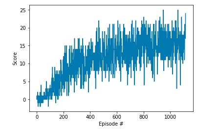
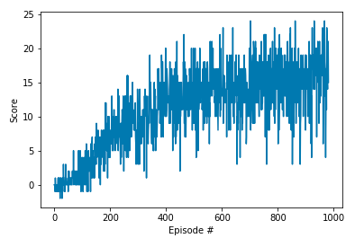
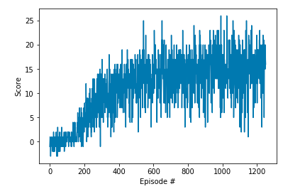
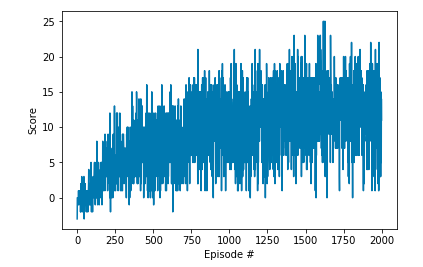

# Report

The algorithm for the agent is Deep Q learning with possibility of using the several improvements.

## Criteria
The environment was considered solved when the agent achieved average of 16+ over 100 episodes.

## Agent
### Layers 
The model uses single hidden layer to approximate the Q value. 

I  first tried testing with a linear model, but it was unable to solve the problem achieving an average  reward over 100 episodes of little more then 11+.

Using two hidden layers solved the environment, but it didn't add any performance improvement over a single hidden layer

### Activations
I've tested several nonlinearities ELU, PReLU, ReLU6 but I didn't gained any performance improvement so I sticked with a RELU.

### Neurons
I've settled on a 48 densely connected neurons, since it solved the environment in all the runs I've tried. Using less neurons like 32 or even 16, solved the environment but it usually took more time to get the solution. Using 8 or less neurons in the hidden layer, was hit and miss and depended on weights initialization.

## Improvements

### Basic
The base of the code is the agent from the Deep Q-Networks lesson. It uses experience replay & two networks (local & target). It solved the environment in around 1000-1300 episodes depending on the initial weights

I've tried several improvements, two of them worked, third one didn't.

### Double DQN
Using double DQN to estimate the Q value, decreased the number of episodes to solve the environment, but the improvement depended on initial weight initialization.

### Dueling DQN
Using dueling DQN solved the environment in about same number of steps as double DQN.

### Priority Experience Buffer
The priority buffer made the situation worse, and the agent was unable to solve the environment in 2000 episodes. Whether is due to mistake in my implementation or due to lack of hyperparameter tuning.

## Potential improvements
The problem was solved relativily quickly by Vanilla DQN with fixed targets & experience replay. Since the improvements that I've tried double DQN & dueling DQN didn't helped much, it might be worth trying the other ideas from the rainbow combination: Noisy Nets, Multi-step returns & Distributional RL.

The other choice is trying different hyperparameter settings.

Or understanding why Priority experience replay made things worse.

However since the problem is relativily small, it might be that complications stemming from "improvements" only bring suboptimal solutions.